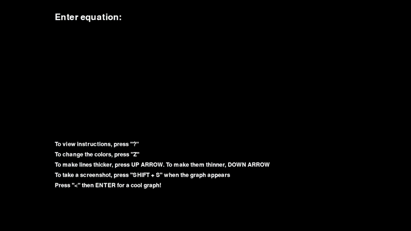
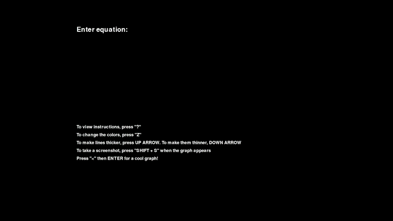

# Lightning Mathematics

Lightning Mathematics is a desktop graphic renderer built with Python. The program graphs user-input such as: single-variable, polar, and parametric expressions while rendering them
with a cool lightning effect. Furthermore, the application an encyclopedia page that analyzes the expression and provides information behind the expression.

---

## Table of Contents

- [Installation](#installation)
- [Instructions](#instructions)
- [Encyclopedia](#encyclopedia)
- [Gallery](#gallery)
  - [Single Expressions](#single-expressions)
  - [Polar Expressions](#polar-expressions)
  - [Parametric Expressions](#parametric-expressions)
- [Mathematics Behind the Lightning](#mathematics-behind-the-lightning)
  - [Midpoint Displacement](#midpoint-displacement)
  - [Perpendicular Vectors](#perpendicular-vectors)
  - [Simplex Noise](#simplex-noise)
  - [Uniform Noise vs. Simplex Noise](#uniform-noise-vs-simplex-noise)
  - [Branch Generation](#branch-generation)
- [Limitations](#limitations)
- [Work in Progress](#work-in-progress)

---

## Installation

1. Clone the repository:

```bash
git clone https://github.com/Pouria-Salekani/Lightning-Mathematics.git
```

2. Navigate into the project directory:

```bash
cd Lightning-Mathematics
```

3. Install dependencies:

```bash
pip install -r requirements.txt
```

4. Run the application:

```bash
python main.py
```

---

## Instructions

The program supports three graphing modes:

* Single-variable expressions (refered to as "single" in the program)
* Polar expressions
* Parametric expressions

The recognized variables are:

| Mode       | Variable |
| ---------- | -------- |
| Single     | x        |
| Polar      | theta    |
| Parametric | t        |

## Gallery
### Single Expressions

Examples:

```python
sin(x)

1/(x**2)

x**2

sin(x)+exp(x)**2-3*x
```
<u>***Notice:***</u> The program follows Python syntax. For example, to graph x², do **not** enter `x^2`. Instead, enter `x**2`.

<p align="center">
  
</p>

---

### Polar Expressions

Examples:

```python
sin(theta)

tan(theta)

theta*0.2

cos(theta)**2 + 1/theta
```

<p align="center">
  
</p>

---

### Parametric Expressions

Parametric expressions require two expressions separated by a comma.

Examples:

```python
sin(t), cos(t)

t**2, 1/(t**3 - sin(t))

exp(t), tan(t)

asin(t)+3*t, t-cos(t)
```

<p align="center">
  
</p>

---

## Encyclopedia

The encyclopedia page stores information based off of the user-input.

The encyclopedia displays the following:

* Expression Input
* Expression Type
* Derivative(s)
* Root(s)
* Domain
* Range

Complex expressions may require several seconds to compute. This delay is typically caused by symbolic computations involving derivatives, roots, domains, or ranges.
This is esspecially true for expressions containing trigonometric functions, such as: 

$tan(x^5) + sin(x^7)$, 

which is inputted as `tan(x**5) + sin(x**7)`.

Please see the ***[limitations](#limitations)***  section for additional information.

<p align="center">
  
</p>

---

## Mathematics Behind the Lightning

The lightning effect is generated using three primary mathematical ideas:

1. Midpoint Displacement
2. Perpendicular Vectors
3. Simplex Noise

For illustration, consider the graph:

$sin(x)$

---

### Midpoint Displacement

Suppose two neighboring points on the graph are:

$P_1 = (x_1,y_1)$

$P_2 = (x_2,y_2)$

The midpoint is computed as:

$M = (P_1 + P_2)/2$

Within the Pygame loop, midpoints will be generated recursively between neighboring points. Using $sin(x)$ as our example, between any two points,
the midpoint will be used to create a "valley" between them. This is the first step of constructing the lightning's jagged structure.

---

### Perpendicular Vectors

The second step is computing a perpendicular vector since midpoints alone are not enough to create a lightning-like appearance.

For each segment, a perpendicular vector is computed and normalized. Then, the midpoint moves along this perpendicular direction by adding the vector to it.

Mathematically:

$M' = M + \delta v$

where:

* $M$ is the original midpoint
* $v$ is the normalized perpendicular vector
* $\delta$ is a pertrubartion amount

Without the perpendicular vector, the midpoint would remain on the original curve and the lightning effect would not form.

Why is the vector needed? Because by just computing the midpoint, the graph would look the same. By adding the vector to it,
this will force midpoint to deviate from from the original curve, hence creating a jagged appearance (think of a `^` being added between a segment). However, in order to visually see the jagged structure,
we need to make it more visible by perturbing it in a smooth fashion.

---

### Simplex Noise

The perturbation value $\delta$ is generated using OpenSimplex Noise.

Unlike purely random values, Simplex Noise produces smoothly varying values. Neighboring points tend to receive similar displacements, creating visually coherent lightning rather than chaotic spikes.

In the implementation:

```python
perturb = noise.noise2(s * 15, time) * 10
```

where:

* $s$ is the normalized segment position
* $time$ animates the noise field
* and the `10` is a scalar

This creates the appearance of living, moving electricity. This is exactly what makes the "valley" visible. Without this and just the above two mathematical principles,
the graph would look the same and not mimic moving electricity.

---

### Uniform Noise vs. Simplex Noise

Uniform Noise:

* Produce sharp discontinuities
* Create unrealistic spikes
* Result in noisy artifacts

Simplex Noise:

* Produces correlated neighboring values
* Creates smooth transitions
* Generates a more natural lightning appearance

---


### Branch Generation

In addition to the primary lightning path, smaller branches are generated recursively.

These branches follow the same midpoint displacement process but uses a random pertrubation (uniform noise). The reason for this is primarily visual and computationally efficient.

Because Simplex Noise smooths out a segment, using it on every branch will make the entire lightning chain will look a double helix. The random pertrubations make them more jagged since its chaotic.

This creates a more realistic electrical discharge effect.


---

## Limitations

Current limitations include:

* Complex-valued outputs are not supported.
* Some symbolic domain and range computations may be difficult or impossible for SymPy to compute exactly.
* Certain expressions (espcially trigonometric) may require several seconds to analyze.
* Approximate numerical methods are used as fallbacks when symbolic methods fail.
* Expressions involving asymptotic behavior, such as $tan(x)$, may produce approximate sampled ranges rather than exact ranges.

---

## Work in Progress

Planned additions include:

* FastAPI backend
* SQLite database integration
* Numerical analysis improvements
* Docker containerization
* External educational resources ("Learn More" functionality)
* Performance optimizations
* Complex numbers addition

This project is actively being developed. Feel free to follow along!
